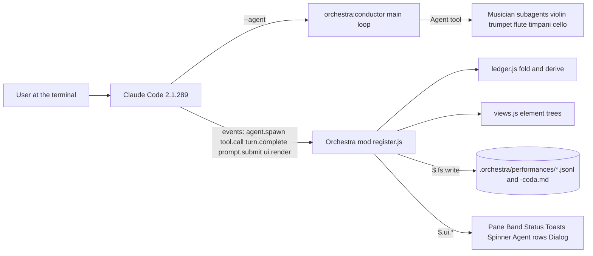

# Orchestra — Product Requirements Document

Version 1.0, 2026-10-05. Target: Claude Code 2.1.289 (mods require 2.1.287 or later [A1]).
Companion documents: `docs/orchestra-research-report.md` (Stage 1 research), `docs/orchestra-prototype-design.md` (approved Stage 2 prototype), `docs/orchestra-spec.md` (engineering spec: event flow, defects, verification plan).
Status markers used in this document: **[VERIFIED: path]** means seen in a real run with that evidence file; **[UNVERIFIED]** means specified but not yet exercised in a real run.

## 1. Overview and goals

### 1.1 What Orchestra is

Orchestra is a Claude Code plugin with two parts:

1. **Agents.** A conductor agent (`orchestra:conductor`) and five musician subagents (`orchestra:violin`, `orchestra:trumpet`, `orchestra:flute`, `orchestra:timpani`, `orchestra:cello`).
2. **A mod.** A hooks module that runs inside Claude Code [A2]. It records every file each musician reads and writes into a per-session ledger with SHA-256 versions. It holds any write that would overwrite another musician's newer work and asks the user. It draws the ensemble on the surfaces a mod is allowed to draw: a pane, the band above the prompt, the status line, toasts, the spinner and Agent tool rows [A3].

Interpretation of the request: "quantum code" is Claude Code, and "quantum code mods" are Claude Code mods. "Wireframes" are terminal wireframes, given in §2 as fixed-width text. "Hidden access" is keyboard and screen-reader access: keys that are not printed on screen, plus non-colour cues. All four are specified here.

What the user experiences, in order:

1. Install the plugin from the public marketplace `krzemienski/orchestra-cc`.
2. Start a session with `claude --agent orchestra:conductor`.
3. Describe a task. The conductor writes `.orchestra/score.md` and starts parts. Independent parts start in the same message, so they run in parallel.
4. While musicians work, the band above the prompt, the status line and the Orchestra pane show who is playing, the tool each is running, measures played, files read and written, handoffs, stale reads and failures.
5. If a musician tries to write a file another musician changed after it last read it, Orchestra holds the write and asks the user in Claude Code's question dialog.
6. When the conductor's turn ends, Orchestra writes the coda file from the ledger. The pane's Coda tab and `/orchestra coda` show the same content.

### 1.2 Reference behaviour

The behaviour is drawn from the approved Stage 2 prototype (`prototype/`), which itself drew on Claude Code's agent view, OpenCode's subagent blocks and Claude Squad's instance list (research report §c).

| Step | Prototype (approved) | Orchestra in Claude Code |
| --- | --- | --- |
| Entry | Page opens on a dark terminal with the ensemble at rest | `claude --agent orchestra:conductor`; header shows `@orchestra:conductor` |
| During | Band, pane tabs, transcript rows and toasts update per event | Same surfaces, drawn by the mod from live tool events |
| Stop | Conflict pauses playback and asks the user | Conflict holds the write and asks in the AskUserQuestion dialog |
| Choose | Keep A / keep B / merge | Let it write / Send it back to re-read / Show both versions (§2.9) |
| Result | Coda tab plus a transcript coda block | Coda tab, `/orchestra coda`, a transcript line, and `.orchestra/performances/<session>-coda.md` |
| Library | Timeline scrubbing over the event log | The ledger file, replayable with `fold()`; Score tab shows the newest events |

### 1.3 Goals

| # | Goal | How we measure it |
| --- | --- | --- |
| G1 | Every musician the conductor starts appears by instrument name within one redraw | tmux capture after an Agent call shows the instrument name in the band; 0 occurrences of `Guest` for `orchestra:*` types |
| G2 | Every file read and write by a musician is recorded with its SHA-256 | For a run, the count of Read/Write/Edit tool calls with `ok` = the count of `artifact.read` + `artifact.write` events; each hash equals `shasum -a 256` of the file at that point (checked for the final version) |
| G3 | A stale-base write never lands silently | In a scripted two-musician run, 1 of 1 conflicting writes raises the dialog (interactive) or is denied (`-p`); the ledger has a `conflict.resolved` event |
| G4 | The coda matches the ledger | The Coda tab, `/orchestra coda` and the coda file list identical contributor counts, conflict count and failure count for the same session |
| G5 | Orchestra never blocks Claude Code | No hook exceeds the 10 s per-event hook budget [A4]; a failed record or draw logs to the debug log and the tool call still runs |
| G6 | Everything is reachable by keyboard | Every pane tab, row selection and dialog option is reachable with keys listed in §2 without a mouse |
| G7 | State is never conveyed by colour alone | Every coloured status also has a glyph and a word (checked against §6.4) |
| G8 | The published plugin installs from GitHub | `claude plugin marketplace add krzemienski/orchestra-cc` and `claude plugin install orchestra@orchestra-cc` both exit 0 in a clean config |

### 1.4 Non-goals (version 1.0)

- Automatic merging of two musicians' versions of a file (§2.9 explains why; opt-in decision).
- Agent teams (split-pane teammates in separate processes).
- Attributing file changes made by Bash commands to a musician.
- Replacing Claude Code's agent panel, `/tasks` or agent view.
- Drawing in the VS Code extension, `claude -p` or cloud sessions, where mods load but do not draw [A2].

### 1.5 Users

Developers who already use Claude Code 2.1.287+ in a terminal or the Desktop app's Code tab, and who already have Claude Code authentication. Orchestra adds no accounts, keys or network services.

## 2. Screens

**Conventions.**
- **Medium.** All surfaces are drawn inside the Claude Code terminal (or the Desktop Code tab) with the mods element set: `Box`, `Text`, `Button`, `Markdown` [A3]. Sizes are in terminal cells (columns × rows), not pixels.
- **Wireframe width.** Wireframes below are drawn at 200 columns for wide layouts and 100 columns for narrow ones.
- **Pane placement.** The pane is a sidebar beside the transcript in a wide fullscreen terminal. Otherwise it is a framed region above the prompt. A pane opened without the user asking is placed from 144 columns, or 110 once the user has opened it once [A4].
- **Colour.** Colours are the tokens in §6.4. Each token is a raw hex colour with an ANSI-name fallback, because `Text.color` accepts a theme key or a raw colour [A5].
- **Glyphs.**

  | Glyph | Meaning |
  | --- | --- |
  | `♪` | playing |
  | `‖` | waiting |
  | `✓` | done |
  | `✕` | failed |
  | `·` | resting |
  | `‼` | conflict |
  | `⚠` | stale read |
  | `𝄐` | Orchestra mark |

  Every glyph is paired with a word somewhere on the same surface (G7).
- **Width rule.** All text is truncated to the surface's `bodyColumns` with `wrap: 'truncate-end'`, so no line wraps unexpectedly.

### 2.1 S1 — Band above the prompt

**Purpose:** a one-line, always-visible roster of the ensemble during a performance.

**Layout (wide, 200 cols):**
```
𝄐 Orchestra   Violin ✓ 4   Trumpet ♪ 3 Edit   Trumpet 2 ‖ 2   Flute ♪ 1 Read   Timpani · 0   ‼ 1 conflict   ⚠ 1 stale
```
Data placement, left to right:
1. `𝄐 Orchestra` in `muted`.
2. One chunk per musician, in assignment order:
   - name in the musician's instrument colour (§6.4), bold;
   - a space, then the state glyph in its state colour;
   - measures played (a number);
   - the tool running now, only while one runs.
3. Alerts at the end: `‼ N conflict` in `danger`, bold, and `⚠ N stale` in `warn`.
4. Chunks are separated by 2 spaces.
5. The band keeps whatever other mods draw there, below Orchestra's row.

**Layout (narrow, 100 cols):** the same chunks, wrapped onto a second row (`flexWrap: 'wrap'`); alerts stay last.

**States:**
- **No performance** (no part assigned): the band shows nothing from Orchestra; other mods' content is unchanged.
- **Performing:** as above.
- **All settled:** every musician shows `✓` or `✕`; alerts show only if still open.
- **Mods disabled:** not drawn.

[VERIFIED: see `docs/verification.md`, S1]

**Controls:** none. The band is display-only. It has no digit hotkeys, because digits typed into an empty prompt would trigger band buttons [A4].

**APIs called:**
- Internal: `ledger.musicians(state)`, `ledger.counts(state)`, `views.band(el, state, width)`.
- Mods API: `ui.render` on `{ component: 'AbovePrompt' }`, `$.ui.resolve(e)`, and `next(e)` to keep other mods' rows.
- External: none.

### 2.2 S2 — Status line

**Purpose:** a compact count of the performance under the prompt, readable when the band is scrolled away.

**Layout:**
```
⚠ orchestra: Orchestra · 2 playing · 1 waiting · 1 done · 3 artifacts changed · 1 conflict · 1 stale
```
- **Prefix:** `⚠ orchestra:` is drawn by Claude Code for a plugin's pinned status [A6].
- **Segments, in order:** `playing`, `waiting` (only if > 0), `done`, `failed` (only if > 0), `artifacts changed`, `conflict` (only if > 0), `stale` (only if > 0).

**States:**
- No performance: cleared (`$.ui.status(undefined)`).
- Performing: as above.
- After reload: rebuilt from the ledger.

[VERIFIED: `e2e-evidence/stage3-interactive-20261005-181339/04-after-send-back.txt` shows `Orchestra · 2 playing · 1 done · 1 artifacts changed`]

**Controls:** none.

**APIs called:**
- Internal: `ledger.statusLine(state)`.
- Mods API: `$.ui.status(text)`.

### 2.3 S3 — Orchestra pane, frame and tab bar

**Purpose:** the detailed view of the performance, with four tabs.

**Layout (wide; sidebar of 56–80 cols beside the transcript):**
```
┌ Orchestra ─────────────────────────────────────────────── ✕ ┐
│ 1: Ensemble   2: Score   3: Artifacts   4: Coda             │
│                                                             │
│ <tab body>                                                  │
└─────────────────────────────────────────────────────────────┘
```
- The active tab label is in `text`; inactive labels are `dimColor`.
- The body width is `e.props.bodyColumns`.

**Layout (narrow):** the same frame above the prompt. Its height is 1/3 of the window unless the user resizes it with Ctrl+X then an arrow key [A4].

**States:**
- **Closed:** nothing drawn.
- **Open, no performance:**
  ```
  Orchestra
  No performance yet. Start one with: claude --agent orchestra:conductor
  ```
  [VERIFIED: `e2e-evidence/stage3-interactive-20261005-181339/01-pane-empty-state.txt`]
- **Open, performing:** tab bar plus the body of the active tab.
- **Narrow, unasked:** an auto-open from the first `part.assigned` waits undrawn until the terminal is 144 columns wide. `/orchestra` always opens it.

**Controls:**

| Key | Action |
| --- | --- |
| `/orchestra` (at the prompt) | Opens the pane with focus |
| `1` `2` `3` `4` | Switch tab |
| Tab, ↑, ↓ | Move between controls |
| Enter | Select or deselect the focused row |
| Esc | Close the pane (`closeOnEscape`) |
| Ctrl+X then X | Close even while focused elsewhere |
| Ctrl+X then Tab | Focus the pane from the prompt |
| Ctrl+X then arrows | Resize |

**APIs called:**
- Mods API: `$.command.register({ name: 'orchestra', immediate: true })`, the `command.run` hook, `$.ui.open({ id: 'orchestra', title: 'Orchestra', focus: true, closeOnEscape: true })`, `$.ui.close('orchestra')`, `ui.render` on `{ component: 'Pane' }` with `e.requestId === 'orchestra'`, and `$.ui.invalidate('ui.render')`.
- Internal: `views.pane`.

### 2.4 S4 — Pane: Ensemble tab

**Purpose:** who is in the ensemble, what each is doing now, and what each has seen.

**Layout:**
```
3 playing in parallel · 2 done

Conductor  Plans the score, assigns parts, resolves conflicts · ♪ playing
  Coordinating the ensemble

Violin  Scout · ✓ done
  Map the upload request path
  4 measures · 3 reads · 1 writes

Trumpet  Implementer · ♪ playing
  Edit config/limits.json
  3 measures · 2 reads · 1 writes   ⚠ stale read

Trumpet 2  Implementer · ‖ waiting
  Edit config/limits.json
  2 measures · 1 reads · 0 writes
```
Data placement per block, line by line:
1. The name: a plain `Button` coloured by instrument (§6.4). Then the role and `glyph state` in `muted`.
2. The current tool and target if running; otherwise the part description from the Agent call.
3. `n measures · r reads · w writes` in `muted`, plus `⚠ stale read` in `warn` while one is open. The conductor has no third line.

**Selected row (Enter on a name)** expands underneath:
```
Trumpet · orchestra:trumpet
Part: Read config/limits.json, then set upload.perMinute to 60 …
Versions it has seen:
  config/limits.json v0 (now v1)
  .orchestra/score.md v1
Answer: Set perMinute to 60 after re-reading v1. Read: config/limits.json …
```
`(now vK)` is in `warn`. The part is truncated to 300 characters and the answer to 400.

**States:**
- No performance: S3's empty state.
- Performing: as above.
- A musician failed: its glyph `✕` and word `failed` in `danger`.
- Selection on a musician that is no longer in the roster: the selection is cleared.

**Controls:**
- Enter on a name toggles its details. Only one row is expanded at a time.
- Tab and ↑/↓ move between names.
- `2`, `3`, `4` switch tabs.

**APIs called:**
- Internal: `ledger.roster`, `ledger.counts`, `views.ensemble`, `views.musicianDetail`.
- Mods API: `$.ui.resolve`, `$.ui.invalidate`.

[VERIFIED: see `docs/verification.md`, S4]

### 2.5 S5 — Pane: Score tab

**Purpose:** a timeline of the ledger, one staff per roster member, so parallel work and handoffs are visible at a glance.

**Layout:**
```
Events 41–96 of the ledger, newest on the right
Conductor  ◆  ◆      ◆                     ?        𝄐
Violin       ·○·○●✓
Trumpet         ·○ ·  ·‼     ←·●✓
Trumpet 2         ·○·●✓
Timpani                    ←·✕       ←·✓

○ read  ← read another's work  ● write  · tool  ◆ assigned  ✓ done  ✕ failed  ‼ conflict  ⚠ stale  ? you decided
```
- **Width.** Lane names take 11 columns. The staff shows the newest (bodyColumns − 12) events.
- **Glyph colours.** `‼` and `✕` in `danger`, `⚠` in `warn`, `✓` in `ok`; other glyphs in the instrument colour.
- **Legend.** The last line, in `muted`.

**States:**
- Fewer events than the width: the staff is left-aligned.
- A musician with no events in the window: an empty staff.

**Controls:** `1`, `3`, `4` switch tabs. The tab has no row controls.

**APIs called:**
- Internal: `views.score` over `state.events`, `state.conflicts`, `state.stale`, `state.handoffs`.

[VERIFIED: see `docs/verification.md`, S5]

### 2.6 S6 — Pane: Artifacts tab

**Purpose:** every file the performance touched, with its version history and readers.

**Layout:**
```
config/limits.json      conflict
  written by Trumpet 2 → Trumpet · 5 reads
src/limiter.js          v0
  read only · 2 reads
README.md               v1
  written by Flute · 1 reads
```
**Selected path (Enter):**
```
config/limits.json
Versions:
  v0 as first seen                       sha256:7554c7b9c1d2
  v1 by Trumpet 2 from v0 +2 −1          sha256:8c84199c6d45
  v2 by Trumpet from v1 +1 −1            sha256:a5ea50206da1
Reads:
  Violin read v0 at event 17
  Trumpet read v0 at event 22
  Trumpet read v1 at event 51
Conflicts:
  ✓ Trumpet wrote from v0 over Trumpet 2's v1 · reread
```
Data placement and colours:
- **Status cell.** `conflict` in `danger` (open conflict), `stale` in `warn` (open stale reader), otherwise `vN` in `muted`.
- **Version line.** Version number, author, base version, line delta, and the first 12 hex characters of the SHA-256 in `muted`.
- **Skipped versions.** `skipped vK` in `danger` when the base is older than the previous version.
- **Reads.** Only the last 8 are shown.
- **Ordering.** Files are listed by newest activity first.

**States:**
- No files touched: `No artifacts touched yet.`
- A file changed outside the ensemble (a hash no musician wrote): its version is labelled `by someone outside the ensemble`.

**Controls:**
- Enter on a path toggles its details.
- Tab and ↑/↓ move between rows.

**APIs called:**
- Internal: `ledger.artifactStatus`, `views.artifacts`, `views.artifactDetail`.

[VERIFIED: see `docs/verification.md`, S6]

### 2.7 S7 — Pane: Coda tab

**Purpose:** the combined result, computed from the ledger.

**Layout:**
```
Task: Raise upload.perMinute to 60, add burst 5, test, and document it
Written to .orchestra/performances/6f1e…-coda.md

Who contributed what
  Trumpet: 2 reads, 1 writes, +1 −1
  Trumpet 2: 1 reads, 1 writes, +2 −1
  Timpani: 4 reads, 0 writes, +0 −0
  Flute: 3 reads, 1 writes, +9 −0
Artifacts changed
  config/limits.json · 2 new · Trumpet 2, Trumpet
  README.md · 1 new · Flute
Handoffs
  Trumpet 2 → Trumpet: config/limits.json v1
Conflicts
  Trumpet tried to write config/limits.json after Trumpet 2 changed it (saw v0, current v1). The write was sent back to re-read first.
Failures
  none
Stale reads
  none
```
- Section headings are bold `text`. `none` is `muted`.

**States:**
- Before the first conductor turn ends: the header line reads `The coda file is written when the conductor's turn ends.`
- Unsettled (musicians still playing): the counts are live.
- Settled: matches the file.

**Controls:** `1`, `2`, `3` switch tabs.

**APIs called:**
- Internal: `ledger.coda(state)`.
- Mods API (on turn end): `$.fs.write(codaFile)`.

[VERIFIED: see `docs/verification.md`, S7]

### 2.8 S8 — Transcript rows: Agent label, spinner, coda line

**Purpose:** put the instrument identity into Claude Code's own transcript.

**Layout:**
```
♪ Trumpet · Implementer · 3 measures
⏺ orchestra:trumpet(Trumpet A: perMinute 60)
  ⎿  Done (6 tool uses · 12.4k tokens · 51s)

✻ Mustering… · 2 musicians playing (1m 51s · ↓ 5.6k tokens)

⏺ Orchestra coda: Orchestra · 0 playing · 5 done · 2 artifacts changed. Written to .orchestra/performances/…-coda.md
```
- **Agent label line.** Drawn above Claude Code's own Agent row, in the instrument colour, bold. Before the spawn resolves it reads `◌ Trumpet · Implementer`.
- **Spinner.** Claude Code's spinner gains the suffix `· N musicians playing` while N > 0.
- **Coda line.** A `$.ui.log` row, written when every musician has settled.

**States:**
- Non-Orchestra Agent rows are left unchanged.
- No musicians playing: spinner unchanged.

[VERIFIED: see `docs/verification.md`, S8. When several parts start in one message, Claude Code draws a single summary row that a mod cannot redraw, so labels appear on single Agent rows only.]

**Controls:** none.

**APIs called:**
- Mods API: `ui.render` on `{ component: 'ToolUse' }` with `e.props.tool === 'Agent'`, `ui.render` on `{ component: 'Spinner' }` via `next({ ...e, props: { …, suffix } })`, and `$.ui.log`.

### 2.9 S9 — Conflict dialog

**Purpose:** stop a write that would overwrite another musician's newer work and let the user decide.

**Layout (Claude Code's AskUserQuestion dialog, header chip `Conflict`):**
```
 ☐ Conflict
│ Orchestra: Trumpet 2 wrote config/limits.json v1 and Trumpet saw v0.
│ Let Trumpet's Edit go ahead?
❯ 1. Let it write
  2. Send it back to re-read
  3. Show both versions
```
- **Musician states.** While the dialog is open the writer shows `‖ waiting` in the band and pane, and a toast `Orchestra · conflict on <path>: <writer> vs <other>` shows for 8 s.

**Choices and outcomes:**
- **Let it write:** the write proceeds. The ledger records `conflict.resolved` with `choice: 'overwrite'`.
- **Send it back to re-read:** the Edit is denied with: "Orchestra: <path> changed after you last read it (<other> wrote vC; you saw vB). Read the file again and reapply your change on top of its current content." The ledger records `choice: 'reread'`.
- **Show both versions:** draws, directly above a second question with options 1 and 2, the lines the other musician added since the writer's version and the writer's proposed change, 3 lines each (Claude Code allows at most 12 rows around the dialog). The pane's Artifacts tab shows the same comparison while the write is held.
- **Dismissed (Esc), or no one to ask (`claude -p`):** treated as *Send it back*.

Automatic merge is a non-goal. It would need a model call inside a held write with a 10 s hook budget, and a bad merge would silently replace both musicians' work.

**States:**
- Open.
- Answered.
- Dismissed.
- Headless (auto send-back).

[Dialog and send-back VERIFIED with the name defect: `e2e-evidence/stage3-interactive-20261005-181339/03-conflict-question.txt`, `04-after-send-back.txt`]

**Controls:**
- ↑/↓ and Enter, or the digit of the option.
- Esc dismisses, which counts as *Send it back*.

**APIs called:**
- Mods API: the `tool.call` hook returning `{ deny }`, `$.ui.ask(question, { header: 'Conflict', options })`, `$.ui.toast`, `$.fs.read` for the pre-write hash.
- Internal: `ledger` event `write.attempt`.

### 2.10 S10 — Toasts

**Purpose:** announce events the user should notice without opening the pane.

**Layout:** the top-right of the transcript, one line each:

| Event | Text | Duration | Colour cue |
| --- | --- | --- | --- |
| Handoff | `Orchestra · handoff: Timpani read config/limits.json v2 from Trumpet` (or `was handed`, when the file was named in the brief) | 4 s | none (default) |
| Stale read | `Orchestra · stale read: Flute worked from v1 of src/limiter.js; Trumpet wrote v2` | 6 s | text begins with `stale read` |
| Failure | `Orchestra · Timpani: Bash failed` | 6 s | text contains `failed` |
| Conflict | `Orchestra · conflict on config/limits.json: Trumpet vs Trumpet 2, sent back to re-read` (or `write allowed`), shown after the decision | 8 s | text begins with `conflict` |
| Coda ready | `Orchestra · coda ready: /orchestra and open the Coda tab` | 6 s | none |

Toasts carry plain text only; the meaning is in the words (G7).

**States:**
- One toast per event.
- Toasts are held while a pane opened with `holdToasts` is open; Orchestra does not set `holdToasts`.

**Controls:** none.

**APIs called:**
- Mods API: `$.ui.toast(text, { timeoutMs })`.

[VERIFIED: see `docs/verification.md`, S10. The conflict toast fires after the decision and states the outcome, because the dialog covers the notification bar while it is open.]

### 2.11 S11 — Slash command output

**Purpose:** a text-only view for users who don't open the pane, and for screen readers.

**Layout:**
```
> /orchestra coda
orchestra: Orchestra · 0 playing · 4 done · 2 artifacts changed
Trumpet: 2 reads, 1 writes, +1 −1
Trumpet 2: 1 reads, 1 writes, +2 −1
Conflict: Trumpet tried to write config/limits.json after Trumpet 2 changed it (saw v0, current v1). The write was sent back to re-read first.
Handoffs: 1

> /orchestra ledger
orchestra: .orchestra/performances/6f1e…jsonl · 112 events · Orchestra · 0 playing · 4 done · 2 artifacts changed
```

**States:**
- With no performance, both commands print `No performance in this session yet…`.
- `/orchestra close` prints nothing and closes the pane.

**Controls:** the arguments `coda`, `ledger`, `close`, or none.

**APIs called:**
- Mods API: the `command.run` hook with `{ command: 'orchestra' }`, returning `{ text }`.

[VERIFIED: see `docs/verification.md`, S11]

### 2.12 Accessibility and keyboard access (all screens)

- **Keyboard (G6).** Every pane control is a `Button`, so Tab, ↑/↓ and Enter reach it. The tabs also have hotkeys `1`–`4`. Ctrl+X then Tab focuses the pane from the prompt, and Ctrl+X then X closes it [A4]. The dialog is Claude Code's own and keeps its key handling.
- **Non-colour cues (G7).** Every state has a glyph and a word. Every alert has a word (`conflict`, `stale`, `failed`). The instrument colour always sits next to the instrument name.
- **Screen readers.** The terminal is read as text: band and status line are single lines in a fixed order, and `/orchestra coda` prints the whole coda as transcript text. In the Desktop app, buttons have labels equal to their visible text.
- **Motion.** Orchestra draws no animation of its own. The spinner's animation is Claude Code's.
- **Contrast.** Every colour token in §6.4 is chosen for at least 4.5:1 against Claude Code's dark terminal background `#0c1018` (and its light counterpart). Verified contrast ratios are listed with the tokens.

## 3. System architecture



**Repository layout (`krzemienski/orchestra-cc`):**

| Path | Contents |
| --- | --- |
| `.claude-plugin/marketplace.json` | Marketplace `orchestra-cc` with one plugin, `orchestra`, source `./plugin` |
| `plugin/.claude-plugin/plugin.json` | Manifest: name `orchestra`, version, MIT |
| `plugin/agents/*.md` | Conductor and five musicians |
| `plugin/hooks/hooks.json` | `{ "modules": ["./register.js"] }` |
| `plugin/hooks/register.js` | Hooks: capture, guard, draw |
| `plugin/hooks/ledger.js` | Pure: `apply`, `fold`, derivations, `coda`, `codaMarkdown`, `statusLine`, `lineDelta` |
| `plugin/hooks/views.js` | Pure: `band`, `pane` and the tab renderers |
| `prototype/` | The approved interactive prototype (static HTML) |
| `docs/` | Research report, prototype design, this PRD, the engineering spec, `verification.md` |
| `README.md`, `LICENSE` | — |

### 3.1 Capture subsystem (`register.js`)

| Hook | Records | Notes |
| --- | --- | --- |
| `session.start` | `session.start` (or replays an existing ledger) | Registers `/orchestra` |
| `prompt.submit` | `prompt` | Only origins `composer`, `bridge`, `sdk`; not slash commands |
| `turn.start` (main loop) | `turn.start` | — |
| `agent.spawn` | `part.assigned` after `next(e)` resolves with an `agentId` | Opens the pane on the first part |
| `tool.call` | `tool.call`; for writes, `write.attempt` before `next` and `artifact.write` after; for Read, `artifact.read` after; `tool.result` always | The conflict guard runs between `write.attempt` and `next` |
| `turn.complete` | `part.done` / `part.failed` for a musician; `turn.end` then coda for the main loop | — |

Hashing: SHA-256 via `crypto.subtle.digest` over the file text read with `$.fs.read`. Both are available in the mod runtime [VERIFIED by `/orch-ping`; output to be saved as evidence per the engineering spec §9 defect 9].

### 3.2 Ledger schema

One JSON object per line. Every event carries `seq` (integer, from 1), `ts` (epoch ms) and `type`. The fields for each `type` are listed in `docs/orchestra-spec.md` §4.2. The derivation rules (versions, conflict, stale read, handoffs, measures, roster, failures) are in spec §4.3. Derived state is never written to the ledger, so replaying the same log always yields the same picture.

### 3.3 Storage and recovery

- The ledger lives at `.orchestra/performances/`. It is written in segments of 500 events (`<session-id>.0001.jsonl`, …); only the newest segment is rewritten.
- On load, segments are concatenated in order and an unparseable final line is skipped.
- `.orchestra/.gitignore` contains `*`.

### 3.4 Security and privacy

- Orchestra makes no network calls.
- It stores, in the user's project only:
  - prompts (at most 500 characters);
  - the conductor's part briefs (at most 600 characters);
  - musicians' answers (at most 1,200 characters);
  - file paths and hashes.
- It never stores file contents.
- The `.gitignore` keeps all of this out of commits.
- The mod runs unsandboxed with the user's permissions [A2], so the published code is the whole of what runs.

### 3.5 Error handling

- **Recording or hashing fails:** the error is logged with `$.ui.log(…, { to: 'debug' })` and the tool call proceeds unchanged (G5).
- **A file can't be read for hashing:** no read or write version is recorded for that call.
- **The ledger write fails:** a debug log entry; the in-memory state continues.
- **The question dialog rejects:** treated as *Send it back*.

### 3.6 Delivery order

Each step can ship on its own:
1. Agents only.
2. Capture and ledger.
3. Conflict guard.
4. Band and status line.
5. Pane tabs.
6. Toasts and Agent-row labels.
7. Segmented ledger.
8. *Show both versions*.
9. Publish.

Steps 1–8 are implemented and verified (`docs/verification.md`); step 9 is the publication.

## 4. Models

Orchestra's agents run on Claude models chosen through each agent's `model` frontmatter. The field accepts `sonnet`, `opus`, `haiku`, `fable`, a full model ID, or `inherit` [A7]. Orchestra's mod calls no model.

| Agent | `model` default | Resolves to (this machine) | Why |
| --- | --- | --- | --- |
| conductor | `inherit` | The session model, here `claude-opus-5-5` (Opus 5.5) | Planning and conflict decisions need the strongest model the user chose |
| trumpet | `inherit` | Same as the session | Code changes |
| violin | `sonnet` | `claude-sonnet-5-5` | Reading and mapping code |
| flute | `sonnet` | `claude-sonnet-5-5` | Documentation |
| cello | `sonnet` | `claude-sonnet-5-5` | Review |
| timpani | `haiku` | `claude-haiku-4-5-20251001` | Running commands and saving logs |

- **Unverified cells.** Prices and context windows for these models are not stated here [UNVERIFIED]; see the vendor's model page.
- **Prompting rules applied.** Agent prompts are plain Markdown. Rules are stated literally: read before editing, write to named paths, name the files read and written. Agents never disable thinking and never force tool use. Effort is inherited from the session.
- **Implemented.** Each agent file carries these `model` values; `sonnet` and `haiku` were checked to resolve with this account before they were set.

## 5. Outputs

| Output | Description shown to users | Harness | Format | How it is produced |
| --- | --- | --- | --- | --- |
| Score | "The plan: parts, owners, inputs, outputs, dependencies" | Conductor (agent) | Markdown, `.orchestra/score.md` | Conductor's Write |
| Notes | "Work passed between musicians" | Musician (agent) | Markdown, `.orchestra/notes/*.md` | Musicians' Write |
| Logs | "Full test and command output" | Timpani (agent) | Text, `.orchestra/logs/*` | Timpani's Bash or Write |
| Ledger | "Everything each musician read and wrote" | Mod | JSONL, `.orchestra/performances/<session>.jsonl` | `record()` per observation |
| Coda | "The combined result" | Mod | Markdown, `<session>-coda.md`; pane tab; `/orchestra coda` | `codaMarkdown(fold(ledger))` at each conductor turn end |

- **Regeneration.** The coda is rewritten at the end of every conductor turn. Replaying the ledger with `fold()` regenerates every derived view.
- **Export.** The coda file is plain Markdown, and the ledger is plain JSONL.

## 6. Configuration

### 6.1 Plugin

| # | Setting | Default | Set in | Per run |
| --- | --- | --- | --- | --- |
| 1 | Main agent | default Claude Code agent | `--agent orchestra:conductor` on the command line | Yes |
| 2 | Plugin directory for development | none | `--plugin-dir ./plugin` | Yes |
| 3 | Agent model per musician | §4 table | `model:` frontmatter in `plugin/agents/*.md` | No |
| 4 | Agent tools per musician | violin: Read, Grep, Glob, Bash, Write; trumpet: Read, Grep, Glob, Edit, Write, Bash; flute: Read, Grep, Glob, Edit, Write; timpani: Read, Grep, Glob, Bash, Write; cello: Read, Grep, Glob, Bash | `tools:` frontmatter | No |

### 6.2 Mod behaviour

| # | Setting | Default | Set in | Per run |
| --- | --- | --- | --- | --- |
| 5 | Pane id | `orchestra` | `register.js` constant `PANE` | No |
| 6 | Write tools guarded | Write, Edit, MultiEdit, NotebookEdit | `register.js` `WRITE_TOOLS` | No |
| 7 | Conflict choice when nobody can answer | Send it back (`reread`) | `guardWrite()` | No |
| 8 | Prompt text kept | 500 characters | `register.js` `short(e.text, 500)` | No |
| 9 | Part brief kept | 600 characters | `register.js` | No |
| 10 | Musician answer kept | 1,200 characters | `register.js` | No |
| 11 | Ledger segment size | 500 events | `register.js` `SEGMENT_EVENTS` | No |
| 12 | Ledger location | `.orchestra/performances/` under the session cwd | `register.js` | No |
| 13 | Prompt origins that set the task | composer, bridge, sdk | `register.js` | No |

### 6.3 Surfaces

| # | Setting | Default | Set in | Per run |
| --- | --- | --- | --- | --- |
| 14 | Toast: handoff | 4,000 ms | `register.js` `$.ui.toast` options | No |
| 15 | Toast: stale read | 6,000 ms | `register.js` | No |
| 16 | Toast: failure | 6,000 ms | `register.js` | No |
| 17 | Toast: conflict | 8,000 ms | `register.js` | No |
| 18 | Toast: coda ready | 6,000 ms | `register.js` | No |
| 19 | Score lane name width | 11 columns | `views.js` | No |
| 20 | Artifact reads shown | last 8 | `views.js` | No |
| 21 | Detail truncation (part / answer) | 300 / 400 characters | `views.js` | No |
| 22 | Auto-open pane on first part | on | `register.js` `agent.spawn` hook | No |
| 23 | Pane width and height | Claude Code's default (sidebar; 1/3 height inline) | User resizes with Ctrl+X then arrows | Yes |

### 6.4 Colour tokens

Contrast ratios are computed with the WCAG 2.x relative-luminance formula against `#0c1018` (dark) and `#ffffff` (light). Every token is at least 4.5:1: the lowest are 6.86 dark and 5.32 light. Run on 2026-10-05: a Python script applying the WCAG formula, with its output pasted into this table.

| # | Token | Default (dark) | Default (light) | Contrast dark / light | ANSI fallback | Used for | Set in |
| --- | --- | --- | --- | --- | --- | --- | --- |
| 24 | `conductor` | `#c3a6ff` | `#6b3fd4` | 9.27 / 6.39 | `cyan` | Conductor name, staff, Agent label | `ledger.js` `INSTRUMENTS` |
| 25 | `violin` (strings) | `#7eaaff` | `#2457d6` | 8.23 / 6.16 | `blue` | Violin | `ledger.js` |
| 26 | `trumpet` (brass) | `#f2b950` | `#8a5a00` | 10.73 / 5.93 | `yellow` | Trumpet | `ledger.js` |
| 27 | `flute` (woodwinds) | `#5fd3a8` | `#1d7a4f` | 10.31 / 5.32 | `green` | Flute | `ledger.js` |
| 28 | `timpani` (percussion) | `#ff8c6e` | `#b4441e` | 8.37 / 5.55 | `red` | Timpani | `ledger.js` |
| 29 | `cello` (strings, low) | `#d78cff` | `#8a2fb4` | 8.24 / 6.67 | `magenta` | Cello | `ledger.js` |
| 30 | `guest` | `#a8b3c7` | `#4f5b70` | 9.01 / 6.86 | `white` | Loops outside the roster (not drawn on surfaces) | `ledger.js` |
| 31 | `ok` | `#6bdc9a` | `#1d7a4f` | 11.18 / 5.32 | `green` | `✓` on the Score, resolved conflicts | `views.js` |
| 32 | `warn` | `#ffc65c` | `#8a5a00` | 12.23 / 5.93 | `yellow` | `⚠`, `(now vK)`, `stale` | `views.js` |
| 33 | `danger` | `#ff6b6b` | `#b42318` | 6.86 / 6.57 | `red` | `‼`, `✕`, `conflict`, `skipped vK` | `views.js` |
| 34 | `muted` | Claude Code `dimColor` | `dimColor` | inherits | dim | Roles, counts, hashes, legends | `views.js` |
| 35 | `text` | Claude Code default foreground | default | inherits | default | Body text, active tab | `views.js` |

- The agent frontmatter `color` (Claude Code's own agent panel) uses the nearest allowed value: conductor `cyan`, violin `blue`, trumpet `yellow`, flute `green`, timpani `red`, cello `purple` [A7].
- Raw hex colours need a truecolor terminal; on a 256-colour terminal they are approximated (observed in tmux). The mode is chosen at start and re-checked every 2 s: the light tokens for a light theme, the ANSI names for an ANSI theme or when `COLORTERM` is not `truecolor`, otherwise the dark tokens.

## 7. Research appendix

### 7.1 Claude Code mods

- **What a mod is.** A mod is a plugin whose `hooks/hooks.json` lists a hooks module. That module exports `register(on, options)` and runs inside Claude Code with the user's permissions [A1][A2].
- **Where a mod can draw.** It can draw a pane, the band above the prompt (`AbovePrompt`), toasts, log lines and a status line. It can redraw `ToolUse` rows, the `Spinner` and the `AskUserQuestion` dialog [A3][A5].
- **Where drawing works.** Mods draw in the CLI and the Desktop Code tab. In VS Code, `-p` and cloud sessions the hooks run but nothing is drawn [A2].
- **Per-agent attribution.** Tool events inside a subagent carry `agentId`; `agent.spawn` resolves to the started subagent's `agentId`; `turn.complete` carries the subagent's `agentId` and `answer` [A8]. This is what makes per-musician attribution possible.
- **Limits.**
  - 10 s per hook;
  - 4 MiB per `$.fs.read`/`$.fs.write`;
  - 4 MiB of `$.store`;
  - redraws throttled to 10/s (30/s in the terminal for visible regions);
  - toasts default to 4 s;
  - a pane opened without the user asking is placed from 144 columns [A4].
- **Keyboard.** Keys reach a mod only while its pane or band has focus. Tab, arrows, Enter, Esc and Ctrl+X chords are fixed by Claude Code [A4].
- **`$.fs.write` is not atomic** [A4].

### 7.2 Subagents and multi-agent data

- **Subagent fields and results.** Subagent frontmatter supports `model`, `tools` and `color`; `color` accepts eight names [A7]. A subagent returns only its final message to the parent [A7].
- **Agent teams.** Teams share a task list but do not lock files, and two teammates editing one file can overwrite each other [A9].
- **Passing work through files.** Anthropic's multi-agent research system has subagents write outputs to storage and pass references, to avoid a "game of telephone" [A10].
- **Implicit decisions.** Cognition argues parallel agents make implicit decisions that conflict [A11]. Orchestra records what each agent actually read before writing, which is the observable part of those decisions.

### 7.3 Reference interfaces

- **Claude Code's agent view.** Shows `1 awaiting input · 1 working · 2 completed` and one activity line per agent [A12].
- **OpenCode.** Renders a subagent as an inline `● Explore Task "…"` block with its tool calls nested [A13].
- **Claude Squad.** Lists instances with a branch, a diffstat and a status dot [A14].
- Orchestra keeps the count summary and the one-line activity. It cannot copy OpenCode's navigable child sessions or Claude Squad's outside-the-agent tmux control (research report §c).

### 7.4 General techniques

- **Still applied:**
  - an append-only event log as the single source of truth;
  - content hashes as artifact identity;
  - optimistic concurrency with a version check at write time.
- **Not used:**
  - locks or leases on files, because the mods API cannot block Bash writes;
  - asking agents to declare their own handoffs or conflicts, because the record would then depend on the agents' accuracy.

### Sources

- [A1] Claude Code CHANGELOG, mods added in 2.1.287 — https://raw.githubusercontent.com/anthropics/claude-code/main/CHANGELOG.md (retrieved 2026-10-05)
- [A2] Mods overview — https://code.claude.com/docs/en/plugins/mods/overview (retrieved 2026-10-05)
- [A3] Draw in the interface — https://code.claude.com/docs/en/plugins/mods/interface (retrieved 2026-10-05)
- [A4] Mods reference: limits, keys, settings — https://code.claude.com/docs/en/plugins/mods/reference (retrieved 2026-10-05)
- [A5] Mods TypeScript declarations (`TextProps`: "Colors are a theme key or a raw color") — https://github.com/anthropics/claude-code/blob/main/mods/types/claude-code.d.ts (retrieved 2026-10-05)
- [A6] Mods API: `$.ui.status`, `$.ui.toast` — https://code.claude.com/docs/en/plugins/mods/api (retrieved 2026-10-05)
- [A7] Create custom subagents (frontmatter: `model`, `tools`, `color`) — https://code.claude.com/docs/en/sub-agents (retrieved 2026-10-05)
- [A8] Mods events: tool calls, turns, subagents — https://code.claude.com/docs/en/plugins/mods/events (retrieved 2026-10-05)
- [A9] Agent teams — https://code.claude.com/docs/en/agent-teams (retrieved 2026-10-05)
- [A10] How we built our multi-agent research system — https://www.anthropic.com/engineering/multi-agent-research-system (retrieved 2026-10-05)
- [A11] Don't Build Multi-Agents — https://cognition.ai/blog/dont-build-multi-agents (retrieved 2026-10-05)
- [A12] Claude Code agent view — https://code.claude.com/docs/en/agent-view (retrieved 2026-10-05)
- [A13] OpenCode repository and demo — https://github.com/anomalyco/opencode (retrieved 2026-10-05)
- [A14] Claude Squad screenshot — https://raw.githubusercontent.com/smtg-ai/claude-squad/main/assets/screenshot.png (retrieved 2026-10-05)

Could not be verified:
- model prices and context windows;
- how 256-colour terminals render raw hex colours;
- whether a subagent's own tool calls appear as `ToolUse` rows in the main transcript;
- the contrast of Claude Code's own `dimColor` against each theme, which Orchestra inherits for muted text.
